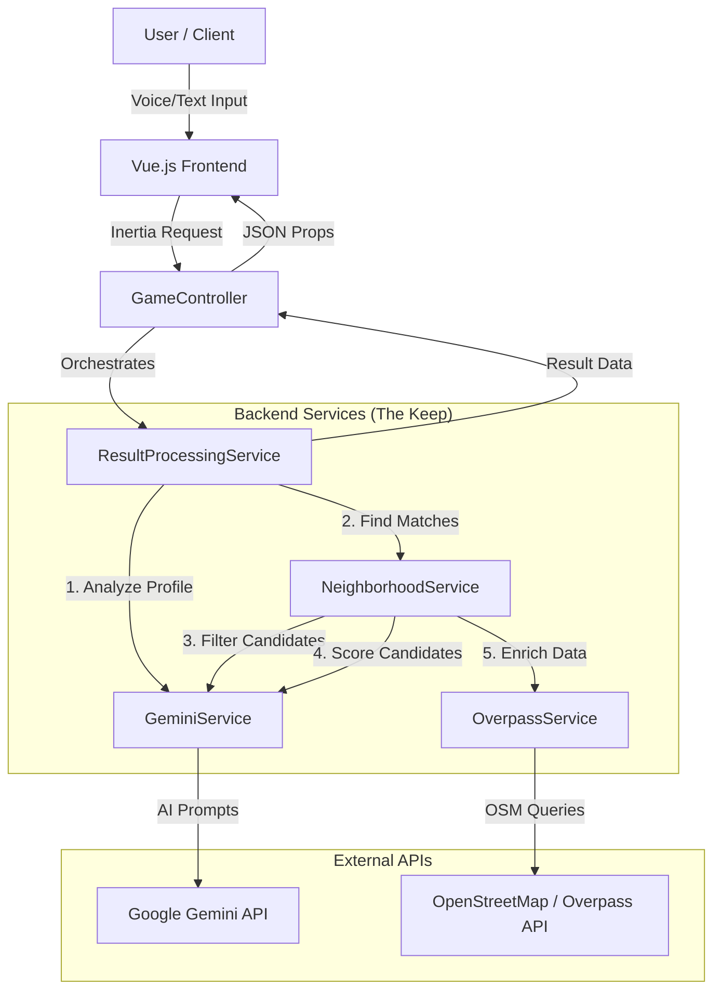

# Technical Overview: El Joc de Barris

This document provides a high-level technical explanation of how **El Joc de Barris** works, detailing the architecture, data flow, and key services involved in the "Sorting Hat" experience for Los Angeles neighborhoods.

## High-Level Architecture

The application follows a standard **Laravel (Backend) + Vue.js (Frontend)** architecture, using **Inertia.js** to glue them together as a monolithic Single Page Application (SPA).

## Core Workflows

### 1. The Analysis Flow ("The Sorting")

When a user submits their description ("decree"), the following chain of events occurs:

1.  **Input Reception**: `GameController` receives the text prompt.
2.  **Profile Analysis**:
    -   `GeminiService` sends the user's text to Google Gemini using the `analyze_profile` prompt.
    -   **Output**: A structured JSON containing the user's **Archetype** (e.g., "The Scholar", "The Merchant") and a set of weighted **KPIs** (Key Performance Indicators) like `safety`, `nightlife`, `nature`.
3.  **Candidate Filtering**:
    -   `NeighborhoodService` takes the list of all LA neighborhoods.
    -   It asks Gemini to filter this huge list down to the top 10 candidates that broadly match the user's profile (`filter_neighborhoods` prompt).
4.  **Scoring**:
    -   For the top candidates, Gemini estimates scores (0-10) for the user's specific KPIs (`score_neighborhoods` prompt).
    -   _Optimization_: These scores are cached to reduce API costs and latency.
5.  **Ranking**:
    -   The backend calculates a weighted match score for each neighborhood based on the user's KPI importance.
6.  **Real-Time Enrichment**:
    -   `OverpassService` queries OpenStreetMap for the top neighborhoods to find real-time amenities (e.g., "nearest tavern" (bar), "healer" (pharmacy)).
7.  **Justification**:
    -   Finally, `GeminiService` generates a personalized narrative explaining _why_ this neighborhood was chosen (`justify_recommendation` prompt).

### 2. The Map & Comparison Flow

-   **Mapbox GL JS** is used to render the interactive map.
-   When a user clicks a different neighborhood, the frontend compares the **KPI scores** of the assigned neighborhood vs. the selected one, showing a visual "Battle of Stats".

## Key Services

### `GeminiService`

-   **Role**: The brain. Handles all communication with Google's Generative AI.
-   **Key Feature**: Uses **Dynamic Prompts** stored in `storage/prompts/`. This allows prompt engineering without code changes.

### `NeighborhoodService`

-   **Role**: The strategist. Manages the list of neighborhoods and the logic for scoring and ranking them.
-   **Key Feature**: Implements a fallback mechanism. If Gemini fails, it uses hardcoded "default" matches to ensure the user always gets a result.

### `OverpassService`

-   **Role**: The scout. Fetches live data from the physical world.
-   **Key Feature**: Translates medieval terms (e.g., "Tavern") into OpenStreetMap tags (e.g., `amenity=bar`).

## Data Privacy & Security

-   User inputs are sent to Google Gemini for analysis but are **not stored** permanently in a database by our application.
-   The session is ephemeral; results are flashed to the session and cleared after display.

## Directory Structure Highlights

-   `app/Services/`: Contains the core business logic (`GeminiService`, `NeighborhoodService`, etc.).
-   `storage/prompts/`: Markdown files containing the system instructions for the AI.
-   `resources/js/`: Vue.js frontend application.
